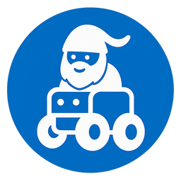

# Політика торгової марки ByByte

- English [`TRADEMARK.md`](TRADEMARK.md)

###### У випадку розбіжностей пріоритет має англомовна версія.

## Загальна інформація

ByByte.DIY™, ByByte Nano™, ByByte Mega™, ByByte NanoBoy™ та пов’язані логотипи є торговими марками команди підтримки проекту ByByte.DIY.

ByByte.DIY — це відкрита екосистема робототехніки та STEM-освіти, орієнтована на доступне навчання, open-source hardware, open-source software та співпрацю спільноти.

Ця політика описує правила використання торгових марок та брендингу ByByte для:

* спільноти;
* викладачів;
* контриб’юторів;
* гуртків;
* шкіл;
* бізнесу;
* сторонніх розробників.

---

# Open Source та торгові марки

Проект ByByte використовує open-source та open-hardware ліцензії для програмного забезпечення, hardware, документації та освітніх матеріалів.

Ці ліцензії дозволяють:

* використовувати;
* вивчати;
* модифікувати;
* поширювати;
* виробляти;
* навчати;
* та комерційно використовувати матеріали проекту відповідно до умов конкретних ліцензій.

Однак open-source ліцензії НЕ надають права використовувати торгові марки ByByte таким чином, що може створювати враження:

* офіційного партнерства;
* сертифікації;
* підтримки;
* або схвалення проектом ByByte.

---

# Дозволене використання

Ви можете використовувати назву ByByte без додаткового дозволу у наступних випадках.

## Освітнє використання

Дозволяється:

* проводити курси на базі ByByte;
* створювати уроки;
* записувати відео;
* проводити майстер-класи;
* використовувати ByByte у школах та гуртках.

Приклади:

* «Курс робототехніки на базі ByByte»
* «Навчання Arduino та ByByte Robotics»

---

## Community та open-source проекти

Дозволяється:

* створювати форки;
* створювати сумісні модулі;
* створювати бібліотеки;
* публікувати модифікації;
* створювати власні проекти на базі ByByte.

Приклади:

* «Compatible with ByByte Nano»
* «Модуль розширення для ByByte Mega»
* «Community firmware для роботів ByByte»

---

## Продаж оригінального обладнання

Дозволяється перепродавати оригінальні плати, набори та компоненти ByByte за умови, що вони чітко позначені як оригінальні та немодифіковані.

---

## Згадування сумісності

Дозволяється чесно вказувати сумісність із продуктами ByByte.

Приклади:

* «Сумісно з ByByte Nano»
* «Працює з ByByte Mega»

---

# Заборонене використання

Без окремого дозволу НЕ дозволяється:

* заявляти про офіційне партнерство;
* створювати враження офіційної підтримки проектом;
* використовувати логотип ByByte як власний бренд;
* продавати модифіковані продукти як офіційні продукти ByByte;
* реєструвати домени, компанії або соціальні мережі, що імітують офіційний проект;
* вводити користувачів в оману щодо походження продуктів або послуг.

---

# Форки та модифіковані версії

Ви можете створювати форки та модифіковані версії проектів ByByte відповідно до open-source ліцензій конкретних репозиторіїв.

Однак:

* модифіковані версії не повинні видаватися за офіційні продукти ByByte;
* суттєво змінені проекти повинні використовувати власний брендинг;
* користувачам має бути зрозуміло, що проект є неофіційним.

Рекомендовані формулювання:

* «Based on ByByte»
* «Fork of ByByte Nano»
* «Неофіційна ByByte-сумісна платформа»

---

# Використання логотипу

Офіційні [логотипи](img/logo.png) ByByte можуть використовуватись:

* у навчальних матеріалах;
* у статтях;
* у відео;
* у оглядах;
* на community-заходах.

Логотипи НЕ можна:

* модифікувати;
* використовувати як основний бренд іншого проекту;
* використовувати таким чином, що створює враження офіційної сертифікації або партнерства.

---

# Комерційне використання

Комерційне використання open-source проектів ByByte дозволяється відповідно до ліцензій конкретних репозиторіїв.

Це включає:

* виробництво hardware;
* продаж наборів;
* платні курси;
* майстер-класи;
* кастомізацію;
* технічну підтримку;
* інтеграцію у комерційні рішення.

Однак використання торгової марки ByByte повинно відповідати цій політиці.

---

# Офіційні проекти та сертифікація

Лише проекти, продукти, сервіси та організації, офіційно погоджені командою ByByte-diy, можуть використовувати формулювання:

* «Official ByByte»
* «Certified ByByte»
* «Authorized ByByte Partner»

---

# Інформація про ліцензії

Різні частини екосистеми ByByte можуть використовувати різні ліцензії.

Типова структура ліцензування:

| Компонент             | Ліцензія      |
| --------------------- | ------------- |
| Software та firmware  | MIT License   |
| Hardware та PCB       | CERN-OHL-S v2 |
| Документація та уроки | CC BY-SA 4.0  |

Детальна інформація вказана у LICENSE-файлах відповідних репозиторіїв.

---

# Повідомлення про порушення

Якщо ви вважаєте, що хтось неправомірно використовує торгові марки ByByte, будь ласка, зверніться до команди підтримки проекту.

---

# Оновлення політики

Ця політика може змінюватися разом із розвитком екосистеми ByByte.

Актуальна версія цього документа вважається офіційною.

---

# Trademark Notice

ByByte.DIY™, ByByte Nano™, ByByte Mega™, ByByte NanoBoy™ та пов’язані логотипи є торговими марками команди підтримки проекту ByByte.DIY.

Усі інші торгові марки належать їхнім власникам.

